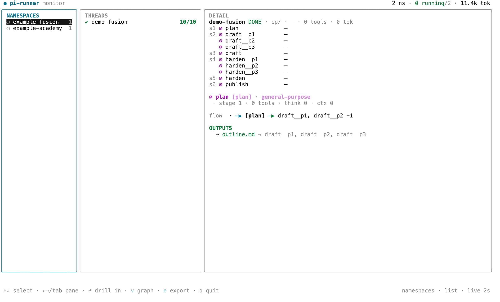
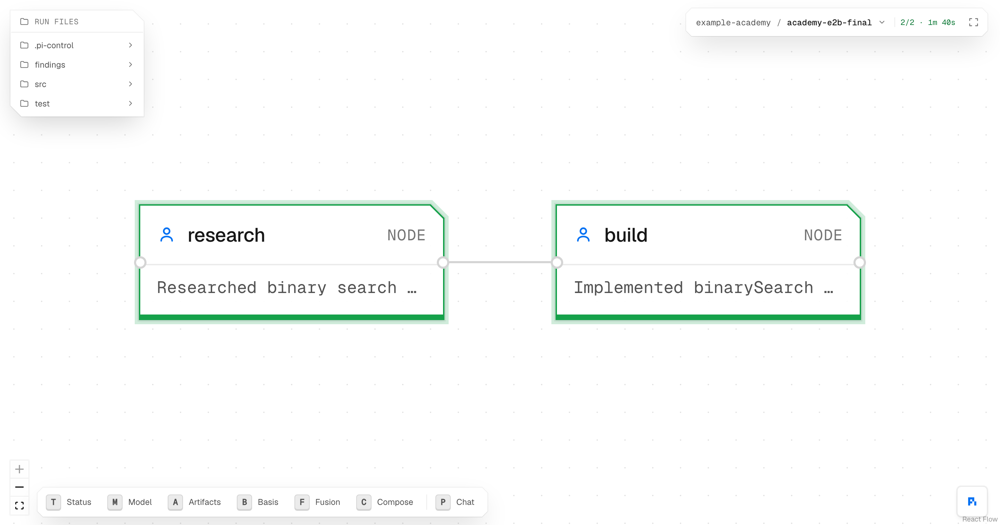

<p align="center">
  
</p>

<h1 align="center">Pi Flow</h1>

<p align="center"><b>Describe a goal. An agent designs the graph, a fleet of sealed full-agent nodes runs it, and a learning loop makes it better every run.</b></p>

<p align="center">
  <a href="https://github.com/blueif16/PiFlow/stargazers"></a> ·
   ·
   ·
   ·
  <a href="https://piflow.sh">piflow.sh</a>
</p>

Pi Flow is an open-source **orchestration substrate for agentic workflows**. Every node in the graph is a **full, sealed `pi` agent** — not a thin model call. The graph is **designed from a goal**, not drawn on a canvas. And a **Hermes-style memory** makes proven flows improve each run. You build it once on Claude Code (`ultracode`); the fleet carries it from there, and you steer the whole thing from your terminal.

## What is Pi Flow?

Three things, stacked, that no single tool gives you together:

- **Self-designing** — hand it a goal; an agent decomposes the work, discovers the right tools for each piece, infers the edges (you don't draw them), and parallelizes by default into a runnable DAG.
- **Durable & sealed** — each node is a complete agent in its own sandbox with exactly the tools and files you grant it. Nodes hand off through the filesystem; plain code owns the graph, so the model never decides control flow.
- **Self-improving** — a background control plane watches every run, fixes a stalled node, gates on a failed check, and writes down what worked — so the next run starts ahead.

It sits in a slot the incumbents don't: **agentic · self-designing · self-improving · long-horizon · production.** Temporal/DBOS are durable but not self-designing; LangGraph is a typed graph for *fixed* flows; CrewAI is role-prototyping; ADAS/AFlow/GEPA design agents *offline*. Pi Flow is the intersection — online, durable, and built on full-agent nodes.

> [!NOTE]
> Pi Flow runs **on top of [`pi`](https://pi.dev)** (`earendil-works/pi`) — the headless agent each node spawns. It's an external prerequisite, installed and credentialed once via `~/.pi/`, not bundled. That's what keeps `@piflow/core` product-agnostic logic.

## The three layers

The product is three layers you can reach for independently — **the agent, the workflow, the memory.**

### P1 · Agents — every node is a full agent in a sealed box

A node is a complete `pi` agent, isolated, holding exactly what you grant it.

| | What you get |
| --- | --- |
| **Node** | A full Pi agent you scope and equip — set its read/write scope, declare its tools and skills, install any MCP or OpenClaw plugin, connect to any MCP server. |
| **Hooks** | Programmatic pre/post checks around every node — the seam where the gate and policy are applied. |
| **Sandbox** | Isolated execution with file-based hand-off. Set a sandbox per workflow, per run, or per node; git-tracked; local, any OS, or a cloud provider. |
| **Telemetry** | See and debug the runtime live — agent-native CLI commands trace every tool call and every sync, with docker-style streaming modes. |
| **Composability** | Snap base agent types + skills + their tools together like Lego; each node grows into exactly the specialist its task needs. |

### P2 · Workflow — hand it a goal, it designs the graph

The DAG that runs the agents — designed, adaptive, and promotable.

| | What you get |
| --- | --- |
| **Compose** | An agent breaks your goal into the work that does it, finds each piece's tools, and wires them into a flow. Independent steps run side by side; dependencies become the edges. |
| **Adaptivity** | Designs that adapt to any DAG change — copy a pre-built, skill-system workflow and migrate in one click; the full monitoring interface visualizes every part of a running flow (watch a model fusion expand the graph in one click). |
| **Cloud** | Promote the whole DAG, a single node, or the rest of a run to a cloud VM with a Kubernetes-style control plane — one click, or a message to an agent — then monitor and control it remotely through the GUI. |

### P3 · Memory — proven flows get better each run

A Hermes-style memory captured *as the agent works*, so corrections compound.

| | What you get |
| --- | --- |
| **Lessons** | Self-correcting memory that records what changed and why — a git-backed collection holds the exact update history; a `memory.md` per node and per workflow turns past corrections into durable guidance. |
| **Functionality** | An optional built-in open code graph indexes the codebase and maintains a slicing of function records, so a `code-map.md` per node carries an exact understanding of how its work gets done. |

## How it works

A Claude Code agent owns the whole loop through the **`@piflow/core` SDK + the `piflowctl` CLI**: it designs the DAG, spawns the fleet, monitors every node, and improves the flow between runs.

```
  COMPOSE ──designs──►  RUN  (one `pi` per node · parallel stages · filesystem state)
     ▲                    │
     │ re-compose         ├─ observe ─► ONE stream ─► GUI · TUI · watch   (monitor-only)
     │ (next phase)       │
     └──────  control plane  ◄── debug → Hermes ──► edit skill / memory
                          (the learning loop = the gradient across runs)
```

That closed loop — **design → run → observe + debug/Hermes → edit skill or re-compose → rerun** — *is* the substrate. The driver owns stage order, parallel lanes, and halt-on-failure; each node ends with one fenced ` ```json ` block the driver verifies against disk (`ok` ⇒ the files exist). Hot-edits land at the **seams, between runs** — never mid-run.

## The two monitors

The GUI and the TUI are **monitor-only twins** — their one job is a clear picture of what's running right now: which nodes are live, their context/cost, the warnings, the shape of the DAG. Both read the same single stream off disk; neither reimplements run state.

<p align="center">
  
</p>

```bash
piflowctl gui                 # the canvas (box-and-arrow DAG, view-mode overlays)
piflow-tui  <rundir>          # the terminal monitor (above)
piflowctl watch <rundir>      # a silent sentinel: one line on done / fail
piflowctl logs  <run> -f      # docker-logs-for-a-run: follow every node's event stream
```

## Quickstart

```bash
# 1 · Prerequisite: the pi agent runtime on your PATH, and a model wired up
pi --list-models cp

# 2 · Install the plugin (3 Claude Code skills) + the piflowctl CLI
git clone https://github.com/blueif16/PiFlow.git && cd PiFlow
for s in piflow-init piflow-enhance piflow-start; do
  ln -sfn "$(pwd)/.claude/skills/$s" ~/.claude/skills/$s
done
npm --prefix packages/cli link        # → the global `piflowctl` bin

# 3 · Dry-run a workflow (free — prints stages, per-node tools/hooks, the pi command),
#     then go live on the fleet (run it in the background and watch)
piflowctl run <templateDir> --provider cp --thinking low --sandbox local --dry-run
piflowctl run <templateDir> --provider cp --thinking low --sandbox local
```

Then steer from the terminal: Claude Code surfaces **`piflow-init`** to design or port a workflow, **`piflow-start`** to run and monitor one, and **`piflow-enhance`** to improve one. You never wire a node on a canvas, click *Run*, or configure a run on a screen — at most you drop in an API key.

> [!TIP]
> The bin links as **`piflowctl`** (bare `piflow` collides with the unrelated `@arche-sh/piflow`). If `piflow` is free on your machine: `alias piflow=piflowctl`.

## What's shipping today

**Running now — the agent layer (P1) and the run engine:** sealed per-node sandboxes (`local` · `seatbelt` · `worktree` · `daytona`), declarative per-node tools (MCP + OpenClaw), pre/post hooks, verified-not-trusted contracts; **true parallel stages** with deterministic stage-barrier promotion; the **one-stream observability** (GUI · TUI · `watch` · `logs`); and fusion nodes.

**In flight — the rest of the loop:** **Compose (P2)**, the design-from-a-goal planner (the `WorkflowSpec` → `compile` boundary is built; the planner is landing); the **Memory layer (P3)**, Hermes lessons + the code graph (designed, mechanism in progress); and the **control plane**, the self-improvement and cloud-promotion loops. These reuse the same node primitive — a control node is just a node with intelligence on a seam — so they're mostly *composition*, not new machinery. See [`ROADMAP.md`](ROADMAP.md).

## The pieces

| Piece | Package / bin | Role |
|---|---|---|
| **Engine (SDK)** | `@piflow/core` | the node-envelope schema, the DAG compiler, the runner, the tool/sandbox plane, and the `observe` stream |
| **CLI** | `@piflow/cli` → `piflowctl` | the front door: `run` · `inspect` · `extract` · `status` · `watch` · `logs` · `gui` |
| **Monitor** | `@piflow/tui` → `piflow-tui` + the GUI canvas (`piflowctl gui`) | monitor-only twins on the **one** `observe` stream |
| **Runtime** | `pi` — external prerequisite | the headless agent each node spawns; credentialed once via `~/.pi/`, kept external so `@piflow/core` stays product-agnostic logic only |

## Documentation

- **[`docs/INDEX.md`](docs/INDEX.md)** — start here: the reading map + the vocabulary.
- **[`docs/ARCHITECTURE.md`](docs/ARCHITECTURE.md)** — the buildable mechanism + what's built today vs the gaps.
- **[`docs/design/l1-node-envelope.md`](docs/design/l1-node-envelope.md)** — the node-envelope schema canon (the frozen spine).
- **[`docs/design/l2-l3-boundary-map.md`](docs/design/l2-l3-boundary-map.md)** — Compose, the control plane, and the closed loop.
- **[`ROADMAP.md`](ROADMAP.md)** — the build order, framework shape, and guardrails.
- **[piflow.sh/docs](https://piflow.sh/docs)** — the hosted docs.

## Security

No secrets ship in this repo. `.env.example` and `models.json.example` contain only placeholders (`sk-REPLACE_ME`, `your-provider.example.com`); the bundled `.gitignore` excludes the real files. Set the credential **once** in pi's own global config (`~/.pi/agent/models.json`, `chmod 600`). Never commit a filled-in credential.

## License

MIT
