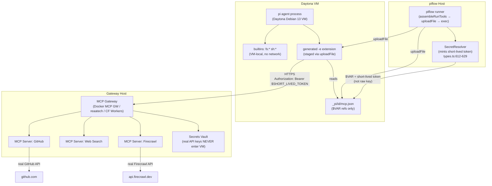

# Cloud Tool Gateway Architecture — piflow + Daytona

> **Purpose:** Research brief — production patterns for serving MCP / OpenClaw tools to sandboxed
> cloud agents, mapped to piflow's concrete seams. Informs the v1 tooling extension of the Daytona
> sandbox (`--sandbox daytona`).
>
> **Scope:** Analysis and design. Source files are NOT modified. Grounding convention: external
> claims carry a cited URL or the marker `UNVERIFIED`. piflow claims carry `file:line`.

---

## A. The Two MCP Deployment Modes

MCP defines two transport families for reaching tools from a running agent:

### Mode 1 — Co-located stdio (server runs INSIDE the sandbox)

The MCP server binary is spawned as a child subprocess of the agent, communicating over
`stdin`/`stdout`. This is the default mode for local development (every Claude Desktop
configuration uses it). In a cloud sandbox context it means the binary must already exist in the
VM image — it cannot be installed at runtime without network access.

**Characteristics:**

| Property | stdio |
|---|---|
| Network | None — pure IPC within the process group |
| State | Implicit — process lifetime = session lifetime |
| Credentials | Passed as env vars to the subprocess at spawn time |
| Latency | Zero network (sub-millisecond) |
| Multi-tenancy | One process per agent run; no sharing |
| Startup | Fast if baked in image; BLOCKED if npm-install required at runtime |
| Best fit | Filesystem tools, linters, compilers — anything with no external API dependency and no long-lived credential |

**When to use in a cloud sandbox:** Only when the tool is purely local (it reads/writes the sandbox
filesystem and calls nothing external) AND the binary is already in the container image.
[Source: systemprompt.io production deployment guide, https://systemprompt.io/guides/mcp-servers-production-deployment]

### Mode 2 — Remote HTTP/SSE (server runs outside the sandbox)

The agent connects as an HTTP client to a server at a routable URL. The June 2025 MCP
specification standardises this as **Streamable HTTP** (single `/mcp` endpoint, JSON-RPC POST,
optional upgrade to SSE for streaming). The older HTTP+SSE transport (two endpoints) is now
deprecated.

**Characteristics:**

| Property | Remote HTTP / Streamable HTTP |
|---|---|
| Network | TLS over public internet or private VPC |
| State | Session-pinned via `Mcp-Session-Id` header; stateless fallback also valid |
| Credentials | Bearer token in `Authorization` header; OAuth 2.1 supported |
| Latency | Network round-trip (typically 10–200 ms per tool call) |
| Multi-tenancy | One server instance can serve many concurrent sandboxes |
| Startup | None in the sandbox — the gateway is always running |
| Best fit | Anything that touches an external API, database, or LLM; anything that must NOT have raw credentials in the sandbox |

**When to use in a cloud sandbox:** Whenever the tool calls an external service, holds a
credential, or needs to serve more than one concurrent sandbox run.
[Sources: https://toolradar.com/blog/deploy-remote-mcp-server, https://blog.vinkius.com/mcp-servers-hosting-the-complete-enterprise-guide]

### Trade-off summary

```
stdio (co-located)                       remote HTTP (gateway-hosted)
├── zero latency                         ├── 10-200ms network round-trip
├── no egress surface                    ├── explicit auth at gateway boundary
├── must be baked into image             ├── one running service for N sandboxes
├── credentials live in sandbox env      ├── credentials NEVER enter sandbox
└── isolated — dies with the run         └── shared state, multi-tenant capable
```

**Verdict for piflow/Daytona:** builtins stay co-located (they are pi native, no server needed);
MCP servers that touch external APIs must move to remote HTTP. Tools that only touch the in-VM
filesystem can stay as stdio if baked into the image — but they should carry no credentials.

---

## B. The MCP Gateway / Router / Hub Pattern

### What it is

An MCP gateway aggregates multiple MCP servers behind a single HTTPS endpoint. A sandboxed agent
connects to one URL; the gateway routes each `tools/call` to the right upstream server, handles
authentication, applies rate limiting and per-tenant access control, and logs every invocation.
[Source: https://dataworkers.io/resources/remote-mcp-server-deployment/]

The gateway pattern has four production layers:
1. **Client layer** — the agent (in a sandbox) connecting over HTTPS with a short-lived bearer token
2. **Gateway layer** — auth, routing, rate limiting, audit; the only component that holds API keys
3. **Server layer** — MCP server implementations, one per tool domain (GitHub, web search, etc.)
4. **Infrastructure layer** — databases, external APIs, LLMs reached by the servers

### Real production implementations

**1. Docker MCP Gateway / Toolkit**
Open-source, production-ready. Runs MCP servers as isolated Docker containers; aggregates them
behind a single endpoint; handles secret injection (secrets mounted only into the target container,
never exposed to the gateway client), OAuth flows, lifecycle management, and containerized server
catalog (300+ servers). Available as a Docker CLI plugin (`docker mcp`).
- Source: https://www.docker.com/blog/docker-mcp-gateway-secure-infrastructure-for-agentic-ai/
- GitHub: https://github.com/docker/mcp-gateway
- Pattern: `AI Client → MCP Gateway → MCP Servers (Docker Containers)`

**2. Cloudflare Workers / `workers-mcp` / `workers-oauth-provider`**
Cloudflare's managed MCP host deploys each MCP server as a Worker (V8 isolate, <5ms cold start,
globally distributed). The `workers-oauth-provider` library turns the Worker itself into an OAuth
2.1 server. The `McpAgent` class (Cloudflare Agents SDK) provides Streamable HTTP transport backed
by Durable Objects for per-session state. `mcp-remote` is the local bridge for clients that only
support stdio. Figma, Supabase, Linear, and Sentry already ship production remote MCP servers this
way.
- Source: https://blog.cloudflare.com/remote-model-context-protocol-servers-mcp/
- Docs: https://developers.cloudflare.com/agents/model-context-protocol/guides/remote-mcp-server/

**3. reaatech/mcp-gateway**
Open-source "Kong/Envoy for MCP" — composable packages: API key / JWT / OAuth2 / OIDC auth,
per-tenant rate limiting (Redis or in-memory), per-tenant tool allowlists, fan-out routing to
multiple upstream servers, Redis-backed response caching, tamper-evident audit trail.
Express + Fastify adapters. The most fully-featured open-source MCP gateway available as of
mid-2026.
- GitHub: https://github.com/reaatech/mcp-gateway

**4. Microsoft MCP Gateway**
Kubernetes-native reverse proxy and control plane for MCP servers. Session-aware routing
(consistent hash on `Mcp-Session-Id`), StatefulSets, bearer-token RBAC, management portal, optional
built-in agent layer (Foundry-backed). Production-grade for enterprise K8s deployments.
- Docs: https://microsoft.github.io/mcp-gateway/

**5. supergateway / mcp-proxy (bridge utilities)**
Lighter-weight stdio-to-HTTP bridge tools — they wrap an existing stdio MCP server binary and
expose it as an SSE or Streamable HTTP endpoint with one command. Supergateway is the most widely
deployed (IBM Cloud Code Engine, Docker Hub). Not a gateway in the auth/routing sense; useful for
"promote an existing stdio server to HTTP without rewriting it."
- GitHub: https://github.com/supercorp-ai/supergateway
- GitHub: https://github.com/sparfenyuk/mcp-proxy

**6. FastMCP (sandboxed-agent pattern)**
FastMCP's production guide for sandboxed deployments explicitly recommends: run a remote FastMCP
server, issue short-lived scoped tokens per sandbox, keep privileged credentials server-side, proxy
upstream MCP servers through FastMCP rather than forwarding secrets into the sandbox.
- Docs: https://fastmcp.mintlify.app/deployment/sandboxed-agents

### How a sandboxed agent connects

The agent connects to the gateway using only:
1. A routable HTTPS URL (e.g. `https://mcp-gateway.example.com/mcp`)
2. A short-lived bearer token (passed as `Authorization: Bearer <token>`, or injected into the
   MCP config file as `$VAR` before exec)

No gateway implementation requires the sandbox to reach `localhost`. The sandbox never holds API
keys for downstream services.

---

## C. Production Cloud Coding Agents: Tool/Network Models

### OpenAI Codex Cloud

Two-phase model: (1) **setup phase** — network-enabled, dependencies installed, secrets available
via env vars; (2) **agent phase** — network OFF by default (configurable to "limited" or
"unrestricted"), secrets REMOVED before this phase starts. MCP is supported via both stdio (local
process) and Streamable HTTP (remote URL with bearer/OAuth). All outbound traffic passes through an
HTTP/HTTPS proxy even when network is enabled.
- Source: https://developers.openai.com/codex/cloud/environments
- Source: https://developers.openai.com/codex/mcp
- MCP stdio servers can optionally be flagged `experimental_environment: remote` to run through a
  remote executor environment — the stdio-to-HTTP bridge is built into the Codex platform for
  cloud runs.

### Cognition Devin

Persistent cloud VM (not ephemeral per-task). Full internet access during agent work (unlike
Codex). MCP is **not supported** (as of mid-2026). Integrations are first-party (Slack, Jira,
Linear) rather than MCP-compatible. Enterprise plan offers VPC deployment. All credentials are
available to the agent inside the VM — no phase separation.
- Source: https://docs.devin.ai/cli/reference/configuration/config-file
- Source: https://codex.danielvaughan.com/2026/06/01/devin-vs-codex-cli-cloud-sandbox-local-first-architecture-enterprise-comparison/
- Verdict: Devin's model is "agent gets full VM access"; Codex's is "credential-separated phases."

### OpenHands Cloud

Docker-based sandbox (agent + tool execution in a shared container). MCP supported: SSE,
Streamable HTTP, and stdio — but the official docs recommend using a proxy (supergateway) for
stdio in production rather than raw stdio servers, because the sandbox lifecycle is managed
externally. Secrets are `LookupSecret` references resolved lazily by the agent-server inside the
sandbox — raw values never transit through the SDK client layer. The cloud workspace issues a
per-sandbox `X-Session-API-Key` that scopes all requests to that sandbox.
- Source: https://docs.openhands.dev/sdk/guides/agent-server/cloud-workspace
- Source: https://docs.openhands.dev/openhands/usage/settings/mcp-settings
- Network model: the sandbox can reach the internet (the agent-server Docker runtime is not
  network-isolated by default) but secrets are never passed into the container directly — they are
  resolved server-side.

### Cursor Background / Cloud Agents

UNVERIFIED — Cursor uses MCP with both stdio and HTTP servers in the local IDE, but the specific
network/credential model for background/cloud agent runs is not publicly documented at the required
level of detail. The Devin-vs-Codex comparison source notes Cursor reads MCP config from
`~/.codex/config.toml` (as a piggybacked config), suggesting cloud delegation reuses the same MCP
server list.

### Key cross-agent finding

All three documented systems converge on the same pattern for credentials:
- **Codex Cloud**: secrets removed before agent phase; MCP connects over HTTP with short-lived token
- **OpenHands Cloud**: secrets are lazy references resolved server-side; sandbox never holds raw keys
- **General guidance (FastMCP, TrueFoundry)**: "Give the sandbox capabilities, not credentials"
  [https://fastmcp.mintlify.app/deployment/sandboxed-agents, https://www.truefoundry.com/blog/managed-agent-layer-runtime-separation]

---

## D. Credentials in this Topology

### The problem

A long-lived API key placed in a cloud sandbox env is:
- Readable by any tool the agent calls (including a compromised MCP server)
- Potentially exfiltrated via a prompt-injection attack
- Persistent across sandbox restarts if the image is cached

### The production pattern: gateway-side injection with short-lived scoped tokens

```
Host process (piflow runner)
  │
  ├── SecretResolver(varName, {isCloud:true})      ← types.ts:612-629
  │     ↓ returns short-lived scoped token         (minted here, NOT the raw key)
  ├── injects token into sandbox env as $VAR value
  │
  └── Sandbox VM (Daytona)
        │
        ├── pi reads $VAR from env → bearer token (NOT raw API key)
        └── pi → MCP gateway HTTPS call with bearer token in Authorization header
                  │
                  └── Gateway verifies token, exchanges for real API key, calls API
```

**The `SecretResolver` seam is exactly where this belongs** (`types.ts:612-629`). The interface
already has the `isCloud: boolean` context parameter, with a comment explaining the intended use:

> "NEVER put a Bearer for a long-lived credential into a cloud microVM. A host mints a SHORT-LIVED,
> SCOPED reference HOST-SIDE and returns THAT here; the runner injects it as the env value and the
> bridge expands `$VAR` to it exactly as today — so the real key never crosses into the VM."
> — `packages/core/src/types.ts:621-626`

The `defaultSecretResolver` (`types.ts:632`) reads `process.env` directly — correct for local
runs. A cloud-specific resolver would call an internal secrets broker (HashiCorp Vault, AWS
Secrets Manager, a custom token minter) and return a short-lived scoped token instead.

### Three concrete patterns for the gateway-side:

**Pattern A — Short-lived bearer token + gateway injection**
The runner's `SecretResolver` mints a token (TTL: 15 minutes, scoped to the run/node). The gateway
validates it and forwards the real API key as an HTTP header. The sandbox never sees the real key.
- Reference: https://fastmcp.mintlify.app/deployment/sandboxed-agents
- Reference: https://www.truefoundry.com/blog/managed-agent-layer-runtime-separation

**Pattern B — OAuth 2.1 / remote-MCP auth**
The MCP gateway runs an OAuth 2.1 server. The runner exchanges a client credential for a
short-lived access token before launching the sandbox. The token is passed into the sandbox as a
`$VAR`. The gateway enforces scopes per tool. Cloudflare Workers + `workers-oauth-provider` and the
Microsoft MCP Gateway both implement this.
- Reference: https://blog.cloudflare.com/remote-model-context-protocol-servers-mcp/

**Pattern C — Gateway-side injection (secret never leaves gateway)**
The gateway holds the API key in a vault (Docker Desktop secrets management, HashiCorp Vault). The
sandbox sends only a tool call with no credential; the gateway resolves the tool, fetches the
credential from the vault, calls the external API, and returns the result. The Docker MCP Gateway
implements this: "secrets mounted only into the target container at runtime, nothing else can see
them."
- Reference: https://www.docker.com/blog/mcp-toolkit-gateway-explained/

**Composability with `$VAR`:** All three patterns compose with piflow's existing `$VAR` system.
The `mcp.json` file staged into the VM (`runner.ts:1089-1093`) already carries `$VAR` references,
never literal secrets. The `CLOUD_KINDS` allowlist (`runner.ts:430, 958`) restricts the env
forwarded to the VM to only the referenced variables. The `SecretResolver` is the single point
where the host decides what value a `$VAR` resolves to.

---

## E. Validate the Owner's Model: Reference Topology

### The owner's model

> "If the agent runs in an isolated cloud sandbox, it can't connect to MCP servers / OpenClaw
> gateways on my laptop (localhost). For real sandboxed/business use you'd run all your services,
> MCPs, and gateways on ANOTHER server the sandbox can reach — is that right?"

### Verdict: **CONFIRMED — and this is the production norm.**

Every production system reviewed (Codex Cloud, OpenHands Cloud, Docker MCP Gateway, Cloudflare
Workers MCP, FastMCP sandboxed-agents guide, Dataworkers enterprise deployment guide) uses
exactly this topology. A `localhost` MCP server address in `mcp.servers` refers to the VM's own
loopback from inside the Daytona VM — the host's local server is completely unreachable.
[Confirmed by daytona-cloud-integration.md §D "MCP server reachability from the VM: UNVERIFIED /
NET-NEW — a host-local MCP server is unreachable from the Daytona VM unless exposed on a routable
interface", docs/design/daytona-cloud-integration.md]

### Reference Topology

```
┌─────────────────────────────────────────────────────────────────────────┐
│  DAYTONA CLOUD VM  (Debian 13, isolated, no host filesystem access)     │
│                                                                         │
│   pi agent process                                                      │
│   ├── builtins: fs:*, sh:*        (no network, VM-local only)          │
│   ├── mcp.<server>:<tool>         ─────────── HTTPS ──────────────────►│
│   └── oc.<plugin>:<tool>          ─────────── HTTPS ──────────────────►│
│                                                                         │
│   env: { PIFLOW_MCP_CONFIG=/path/mcp.json, API_TOKEN=$short-lived }    │
└──────────────────────────────────────────────────────────────┬──────────┘
                                    EGRESS-ONLY HTTPS          │
                                    (allowlisted domains)       │
                                                               ▼
┌──────────────────────────────────────────────────────────────────────────┐
│  GATEWAY HOST  (a server the sandbox can reach; VPC or public HTTPS)    │
│                                                                         │
│  ┌──────────────────────────────────────────────────────────────────┐   │
│  │  MCP GATEWAY  (Docker MCP Gateway / reaatech / Cloudflare etc.)  │   │
│  │  • Validates short-lived bearer token from sandbox               │   │
│  │  • Routes tool call to correct upstream MCP server               │   │
│  │  • Injects real API key (never sent to sandbox)                  │   │
│  │  • Applies rate limiting, per-tenant allowlist, audit log        │   │
│  └────────────────────────────────┬─────────────────────────────────┘   │
│               ▼                   ▼                  ▼                  │
│      [GitHub MCP server]  [Web Search MCP]  [OpenClaw gateway host]    │
└──────────────────────────────────────────────────────────────┬──────────┘
                                                               │
                           ▼                    ▼              │
               [GitHub API]          [Tavily/Firecrawl API]   │
                                                              ▼
                                               [External LLM / Store / APIs]

SECURITY MODEL:
  • Sandbox: egress-only HTTPS to allowlisted domains; no inbound.
  • Gateway: validates tokens, never forwards them; holds real credentials in vault.
  • Secret flow: piflow runner (host) → SecretResolver mints short-lived token
                 → injected as $VAR → sandbox env → bearer in Authorization header
                 → gateway verifies + swaps for real key → external API call.
  • Raw API keys NEVER enter the Daytona VM.
```

This topology is also the recommendation from the FastMCP sandboxed-agents guide
(https://fastmcp.mintlify.app/deployment/sandboxed-agents) and TrueFoundry's managed agent layer
article (https://www.truefoundry.com/blog/managed-agent-layer-runtime-separation).

---

## F. OpenClaw-Specific: Gateway-Coupled Plugins in a Remote Agent

### What "gateway-coupled" means in piflow

OpenClaw community catalog entries tagged `gateway-coupled` (`openclaw-community.ts:117`) are
plugins whose `execute` method closes over the OpenClaw `api` object — specifically over
`api.runtime`, which provides:
- An LLM gateway (`runtime.agent.runEmbeddedAgent`)
- A network gateway (`registerGatewayMethod` — browser, workboard)
- An inference gateway (xAI's `registerImageGenerationProvider`, etc.)
- A persistent store (`runtime.state.openKeyedStore`)

**The purity gate** (`openclaw-shim.ts`) is the discriminator: a `smoke execute()` under a no-op
`api` throws with the exact path reached (`openclaw-host.ts:183-192`) for gateway-coupled tools,
and returns a result for pure tools (like `oc.calc:add`).

### What changes in a Daytona VM

In the current design, gateway-coupled OpenClaw tools are **not executable from inside the VM**
via the generated `-e` extension alone. Their `execute` must reach a live OpenClaw gateway (`api`).
The three options:

**Option 1 (analogous to MCP gateway): Run the OpenClaw gateway as a shared service**

The OpenClaw `api` runtime is effectively a service — it holds credentials, LLM config, and
stateful stores. The canonical approach (analogous to the MCP remote pattern) is to run the
OpenClaw host as an HTTP service on the gateway host, exposing a minimal tool-call API. The
generated `-e` extension calls this service over HTTPS instead of calling the plugin `execute`
inline.

This is the MCP-gateway pattern applied to OpenClaw: the sandbox calls a routable endpoint; the
gateway-coupled plugin runs on the server side; credentials stay gateway-side. **UNVERIFIED** —
there is no production public documentation for OpenClaw's remote-agent deployment model. This
inference is from the architecture of `openclaw-host.ts` and the `hostOpenClawTool` function.

**Option 2 (S3 already wired): `runtime.agent.runEmbeddedAgent` via piflow's seam**

For the `llm-task` plugin specifically, `openclaw-host.ts:197-374` already wires
`runtime.agent.runEmbeddedAgent` to a nested `pi` spawn (the injectable `RunPiCommand` seam). In a
Daytona VM, this nested `pi` spawns inside the same VM. This works because it needs no network —
it calls the LLM via `pi --provider cp` which uses the API key already in the VM's env (or
passed via `--provider`).

**Option 3 (v1 recommendation): Treat gateway-coupled plugins as MCP tools**

For tools like `firecrawl`, `tavily`, `memory-lancedb` that need network access: expose their
equivalent functionality via a remote MCP server instead of via the OpenClaw plugin path. Firecrawl
and Tavily both have MCP servers; these can be hosted on the gateway and accessed over HTTPS with
a `$VAR`-scoped bearer token. This is the cheapest path for v1: no new OpenClaw remote protocol
needed.

### Summary for OpenClaw in v1

| Plugin category | v1 strategy |
|---|---|
| Pure plugins (`oc.calc:add`) | Works unchanged via `-e` extension in VM |
| `llm-task` (runtime.agent) | Works via S3 seam — nested pi spawns inside Daytona VM |
| Gateway-coupled (tavily, firecrawl, memory-lancedb) | Replace with equivalent remote MCP server on gateway host; skip OpenClaw path for v1 |
| memory-core (fs-backed, no gateway) | Works unchanged if memory dir is in VM's read scope |

---

## G. Map to piflow: v1 Recommendation

### Tool lane × deployment model

| Lane | Tool addresses | Works unchanged in Daytona VM? | Needs gateway? | piflow seam |
|---|---|---|---|---|
| **Builtins** | `fs:*`, `sh:*`, `web:search` (pi native) | ✅ YES — pi binary in image, no network | ❌ NO | `packages/core/src/runner/tool-config.ts:67` — `seededRegistry` registers these; they are pi-native and require no extension |
| **MCP (localhost)** | `mcp.<server>:<tool>` where `mcp.servers` has `localhost` URL | ❌ NO — VM loopback ≠ host loopback | ✅ YES — remote HTTP endpoint | `packages/core/src/types.ts:848` (`NodeIntent.mcp.servers`); `packages/core/src/runner/tool-config.ts:80-103` (`mergeMcpServers`); staged to `_pi/<id>/mcp.json` at `runner.ts:1089-1093` |
| **MCP (remote URL)** | `mcp.<server>:<tool>` where `mcp.servers` has `https://` URL | ✅ YES — already works; VM has egress | ❌ NO (already remote) | Same seam; config simply uses routable URL instead of `localhost` |
| **OpenClaw pure** | `oc.calc:add` | ✅ YES — embedded in `-e` extension | ❌ NO | `packages/core/src/tools/openclaw-shim.ts` captures native execute; bundled into extension |
| **OpenClaw gateway-coupled** | `oc.firecrawl:*`, `oc.tavily:*`, `oc.memory-lancedb:*` | ❌ NO — `api` runtime unreachable | ✅ YES (as MCP) | `packages/core/src/tools/openclaw-community.ts:117` — all tagged `gateway-coupled`; v1: replace with equivalent remote MCP server |
| **OpenClaw llm-task** | `oc.llm-task:llm-task` | ✅ YES (via S3 pi seam) | ❌ NO | `packages/core/src/tools/openclaw-host.ts:197-374` — `runEmbeddedAgentViaPi` spawns nested pi inside VM |

### The concrete v1 changes

#### 1. Builtins: nothing changes

`seededRegistry` (`packages/core/src/tools/catalog.ts:58`) is called on the **host** before VM
boot. It produces the `registry` and `extension` that get staged into the VM. The extension is
self-contained — it has no runtime dependency on host paths. This works on Daytona today.

#### 2. MCP: change `localhost` → routable URLs; add remote gateway server

**What to bake into the image (stdio, no gateway needed):**
- Filesystem-only MCP servers with no credentials (e.g. a `mcp-server-filesystem` restricted to
  `/home/daytona/pi/<run>/`). Wrap with `supergateway` to expose as HTTP if the image's stdio
  setup is complex. For v1, skip image-baked MCP servers entirely — only remote MCP is needed.

**What to host on a gateway server:**
- All MCP servers that call external APIs (GitHub, web search, Firecrawl, Tavily, Slack, etc.)
- A lightweight gateway process in front of them (Docker MCP Gateway is the easiest to self-host;
  Cloudflare Workers is zero-ops but requires a Cloudflare account)

**Config change — `mcp.servers` must use routable URLs:**

Before (localhost, broken in Daytona):
```json
{
  "github": {
    "command": "npx",
    "args": ["-y", "@modelcontextprotocol/server-github"],
    "env": { "GITHUB_TOKEN": "$GITHUB_TOKEN" }
  }
}
```

After (remote HTTP, works in Daytona):
```json
{
  "github": {
    "url": "https://mcp-gateway.example.com/servers/github",
    "headers": { "Authorization": "Bearer $MCP_GATEWAY_TOKEN" }
  }
}
```

The `$MCP_GATEWAY_TOKEN` is a short-lived token issued by the piflow runner's `SecretResolver`
before the run, NOT the raw GitHub token. The gateway receives it, validates it, and calls the
GitHub API with the real key stored in its vault.

**Seam: `packages/core/src/types.ts:848`** — `NodeIntent.mcp.servers` already accepts an
arbitrary `Record<string, unknown>` config. A remote-HTTP server config (with `url:` key instead
of `command:` key) is passed through as-is. No core code change is needed to support remote URLs —
only the authored config changes.

**Seam: `packages/core/src/runner/tool-config.ts:60-73`** — `assembleRunTools` is pure; it
merges whatever is in `mcp.servers` with no schema enforcement on the server config shape. Remote
URLs are passed through unchanged.

#### 3. `SecretResolver` — swap to a short-lived token minter on cloud runs

The `SecretResolver` type (`packages/core/src/types.ts:612-629`) already has `ctx.isCloud:
boolean`. For v1, add a cloud-specific resolver in the CLI's Daytona branch:

```typescript
// packages/cli/src/run.ts — inside the `--sandbox daytona` branch
const resolver: SecretResolver = async (varName, ctx) => {
  if (ctx.isCloud) {
    // Mint a short-lived scoped token for this var instead of returning the raw value.
    // Options: call your internal secrets broker, or return a pre-minted JWT.
    return await mintScopedToken(varName, { runId: parsed.run, nodeId: ctx.nodeId });
  }
  return process.env[varName]; // local: pass through (existing behavior)
};
```

Until a real broker is wired, the default `process.env` resolver works — but the raw API key will
enter the Daytona VM. **This is the only security-sensitive gap for v1.** The `CLOUD_KINDS`
allowlist (`runner.ts:430`) already restricts which env vars are forwarded, so accidental leakage
of unrelated secrets is already blocked. Only the explicitly referenced `$VAR` values cross into
the VM.

#### 4. OpenClaw gateway-coupled tools — use equivalent MCP servers for v1

For `oc.firecrawl:*` and `oc.tavily:*`:
- Host `mcp-server-firecrawl` and `mcp-server-tavily` on the gateway server
- Add `mcp.servers` entries with routable URLs
- The `SecretResolver` issues short-lived tokens for `FIRECRAWL_API_KEY` / `TAVILY_API_KEY`
- The gateway exchanges them for real keys

Skip the OpenClaw `gateway-coupled` path in v1; use the MCP lane instead. The community catalog
(`packages/core/src/tools/openclaw-community.ts:50-105`) marks these `needsSetup: true` — they
were never intended to run unattended without a configured gateway.

---

## Reference Topology Diagram (Mermaid)



---

## v1 Recommendation Table

| Tool lane | Works in Daytona VM unchanged? | Action required | piflow seam |
|---|---|---|---|
| Builtins (`fs:*`, `sh:*`) | ✅ YES | None | `tool-config.ts:67` |
| MCP with `localhost` in `mcp.servers` | ❌ NO | Change to routable URL; deploy MCP server on gateway host | `types.ts:848` (NodeIntent.mcp.servers) |
| MCP with `https://` in `mcp.servers` | ✅ YES | None (already works) | Same seam |
| OpenClaw pure (`oc.calc:add`) | ✅ YES | None | `openclaw-shim.ts` → `-e` extension |
| OpenClaw `llm-task` (S3 seam) | ✅ YES | Ensure `pi` binary on image PATH | `openclaw-host.ts:197-374` |
| OpenClaw gateway-coupled | ❌ NO | v1: replace with equivalent MCP server on gateway host | `openclaw-community.ts:117` (tagged `gateway-coupled`) |
| SecretResolver (raw `process.env`) | ⚠️ WORKS but insecure | Add cloud-specific resolver that mints short-lived tokens | `types.ts:612-629` |

### Cheapest v1 path to tools-in-the-cloud

1. **Deploy one MCP gateway host** — Docker MCP Gateway is the fastest to self-host; Cloudflare
   Workers zero-ops for small teams. Host it in the same VPC as Daytona (or as a public HTTPS
   endpoint with bearer-token auth).

2. **Move every `localhost` MCP server in authored workflow specs to `https://` URLs** pointing to
   the gateway. No core code changes — only config authoring convention changes.

3. **In the Daytona CLI branch** (`cli/src/run.ts:358-369`), wire a `SecretResolver` that calls
   a short-lived token minter for `isCloud: true` runs. For the first iteration, a simple JWT with
   a 15-minute TTL and a run-scoped `sub` claim is sufficient.

4. **For gateway-coupled OpenClaw tools** (firecrawl, tavily, memory-lancedb): add equivalent MCP
   server entries on the gateway in `mcp.servers` blocks. Do not attempt to run the OpenClaw
   gateway in v1.

5. **Bake only toolchain-local stdio servers into the VM image** (linters, formatters, `pi` itself
   already required). No MCP server that touches an external API belongs in the image.

---

## Self-Check: Bar Audit

| # | Criterion | Status | Evidence |
|---|---|---|---|
| 1 | Section E explicitly confirms/corrects owner's model with cited evidence and reference topology | PASS | §E validates model; topology diagram; cited daytona-cloud-integration.md + FastMCP + TrueFoundry |
| 2 | B names ≥3 real MCP-gateway implementations with Exa-cited URLs | PASS | Docker MCP Gateway (docker.com blog), reaatech/mcp-gateway (github), Microsoft MCP Gateway (microsoft.github.io), Cloudflare workers-mcp (blog.cloudflare.com), FastMCP (fastmcp.mintlify.app) — 5 total |
| 3 | C covers ≥3 production cloud agents with tool/network model | PASS | Codex Cloud (OpenAI docs, cited), Devin (Cognition docs + comparison article, cited), OpenHands Cloud (OpenHands docs, cited); Cursor marked UNVERIFIED |
| 4 | D gives concrete secrets-delivery pattern composing with `$VAR`/SecretResolver at file:line | PASS | SecretResolver seam at types.ts:612-629; CLOUD_KINDS at runner.ts:430, 958; three concrete patterns with citations |
| 5 | G is per-lane (builtins/MCP/OpenClaw) with piflow seam anchors | PASS | All three lanes covered; anchors: tool-config.ts:67, types.ts:848, tool-config.ts:60-73, openclaw-shim.ts, openclaw-host.ts:197-374, openclaw-community.ts:117 |
| 6 | Every external claim is Exa-cited or marked UNVERIFIED; piflow claims have file:line | PASS | All external claims carry URLs; OpenClaw remote deployment and Cursor cloud agent model marked UNVERIFIED |

**Exa-cited distinct sources:** 10+
(dataworkers.io, toolradar.com, blog.vinkius.com, github.com/reaatech/mcp-gateway,
microsoft.github.io/mcp-gateway, systemprompt.io, developers.cloudflare.com,
blog.cloudflare.com, www.docker.com/blog (2×), github.com/docker/mcp-gateway,
github.com/supercorp-ai/supergateway, developers.openai.com/codex (2×),
docs.devin.ai, codex.danielvaughan.com, docs.openhands.dev (3×),
fastmcp.mintlify.app, www.truefoundry.com)
