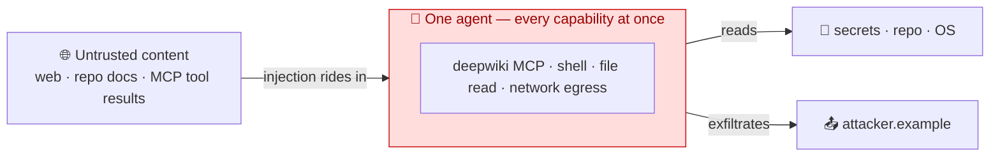
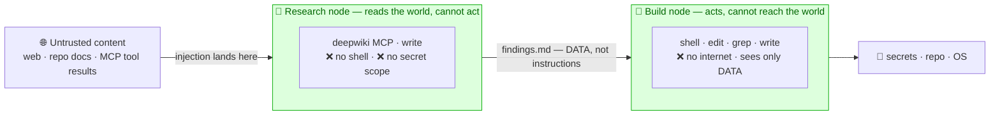

# Per-node capability isolation as a prompt-injection blast-radius control

**Date:** 2026-06-27 · **Status:** reference (grounds the `example-academy` demo template) · **Sandbox proof:** the
companion E2B smoke (coding-in-sandbox + external-MCP-in-sandbox) — see `docs/research/2026-06-27-full-agent-sandbox-smoke.md`.

> The honest thesis, in one line: **piflow lets the orchestrator *enforce* least-privilege per node — it removes a
> capability rather than asking the model to behave.** It does **not** claim "splitting stops prompt injection."

This doc exists so the demo template can *reference* established security work instead of re-deriving (or worse,
staging) it. Every load-bearing claim is cited; unverifiable claims are flagged `UNVERIFIED`.

---

## 1. The claim, stated honestly

A single agent that researches the web/MCP *and* runs code *and* can reach secrets holds all three legs of the
**lethal trifecta** (private data · untrusted content · an exfiltration channel) at once. piflow runs **one real
agent per node** and the orchestrator launches each node with only the capabilities its job needs — so the node
that ingests untrusted content has **no shell and no secret read-scope**, and the node that runs code **never sees
the raw untrusted bytes**. An injection that lands on the research node has nothing to escalate with; the build
node never ingests it.

**What we DO claim:** the injection cannot *escalate* (to code-exec / secret-exfil), because the capability was
removed by the orchestrator — model-independently and reproducibly.

**What we do NOT claim:** that the research node won't be *fooled* (it can still produce a bad summary); that
splitting is *necessary* (a monolith with default-deny egress + a filesystem jail recovers much of the benefit);
or that this "prevents prompt injection."

## 2. Why a single structural demo, not an A/B

A true A/B (monolith escalates, split doesn't) only lands if the monolith *actually* escalates — i.e. if the model
*falls for* the injection. That makes the punchline depend on a probabilistic, model-dependent event, and invites
the rebuttal *"you just used a worse model."* But the whole point of the security argument
([The Attacker Moves Second](https://arxiv.org/abs/2510.09023), Oct 2025 — adaptive attacks beat **12** prompt-level
defenses at **>90%** ASR) is that **you must not rely on the model resisting.** So the demonstration is
**structural**: we show the enforced capability boundary in `pi --tools` + the sandbox profile + the telemetry —
true whether or not any model would be fooled. The A/B reasoning and its failure modes are *referenced* here, not
performed.

## 3. Established-pattern grounding (we are not inventing this)

| Pattern / source | Who · when | Why it grounds us |
|---|---|---|
| [The Dual-LLM pattern](https://simonwillison.net/2023/Apr/25/dual-llm-pattern/) | Simon Willison · 2023-04-25 | The component that reads untrusted content has **no tools**; the privileged one never reads untrusted content. **Our exact split.** |
| [The lethal trifecta](https://simonwillison.net/2025/Jun/16/the-lethal-trifecta/) | Simon Willison · 2025-06-16 | private data + untrusted content + exfiltration = exposure; cutting one leg structurally is the reliable defense. |
| [Agents Rule of Two](https://ai.meta.com/blog/practical-ai-agent-security/) | Meta AI · 2025-10-31 | An agent should hold **at most 2 of 3** {untrusted input, sensitive access, change/communicate}; all three needs a human. Directly validates per-node leg-cutting. |
| [Defeating Prompt Injections by Design (CaMeL)](https://arxiv.org/abs/2503.18813) | DeepMind (Debenedetti et al.) · arXiv:2503.18813, rev 2025-06 | Capability/IFC + plan-then-execute; first defense claiming *provable* guarantees (77% AgentDojo with security vs 84% undefended). |
| [Design Patterns for Securing LLM Agents](https://arxiv.org/abs/2506.08837) | Beurer-Kellner et al. (MS/Google/IBM/ETH) · arXiv:2506.08837, 2025-06 | Names *privilege separation*, *plan-then-execute*, *context-minimization*, *sub-agent isolation* — our architecture is map-reduce + privilege separation. |
| [The Attacker Moves Second](https://arxiv.org/abs/2510.09023) | Nasr/Carlini/Tramèr et al. (OpenAI+Anthropic+DeepMind) · arXiv:2510.09023, 2025-10 | Adaptive attacks bypass detectors/classifiers >90%. **Our strongest line: structure holds where detectors don't.** |
| [OWASP LLM Prompt Injection Prevention Cheat Sheet](https://cheatsheetseries.owasp.org/cheatsheets/LLM_Prompt_Injection_Prevention_Cheat_Sheet.html) | OWASP · 2025 | Endorses dual-LLM as the "strongest architectural form." |

## 4. The MCP attack surface is real (why isolating the MCP node matters)

Tool poisoning — malicious instructions embedded in a tool's `description`/schema, passed unsanitized into the
model's context — is formalized as [OWASP MCP03:2025](https://owasp.org/www-project-mcp-top-10/2025/MCP03-2025%E2%80%93Tool-Poisoning)
(first shown by Invariant Labs, Apr 2025). Verified CVEs in MCP-consuming tools:
[CVE-2025-54136 (MCPoison)](https://research.checkpoint.com/2025/cursor-vulnerability-mcpoison/) and CVE-2025-54135
(CurXecute) in Cursor (Check Point, disclosed 2025-07-16, fixed in Cursor 1.3); CVE-2025-6514 (`mcp-remote` OS
command injection, JFrog); CVE-2025-49596 (MCP Inspector RCE, CVSS 9.4). Putting MCP access on an otherwise
tool-less, no-egress node means a poisoned tool description lands somewhere that can't act on it.

- `UNVERIFIED`: a secondary reference to **CVE-2025-66479** (sandbox egress not enforced on empty `allowedDomains`)
  appeared in one vendor blog only; not confirmed against NVD — do not cite without checking.
- No "ClawBleed"-named CVE was found; treat that earlier mention as unconfirmed.

## 5. Counter-case — what would make a demo dishonest

- **Straw-man baseline.** The fair monolith has the **same total** capabilities; the honest point is that it can't
  *separate* them per-task, not that it's unsandboxed.
- **Trifecta re-forming across the handoff.** If the research node's text flows into the build node as
  *instructions it executes*, escalation returns. The handoff must be **data, not instructions**.
- **Exfil via the research node's own egress.** The untrusted-content node must hold **no secrets** and have no
  path to leak — else the trifecta sits on one node.
- **Conversation-channel leaks.** Egress sandboxing alone doesn't stop a node from *saying* secrets back into a
  shared transcript (WashU: 63.4% of agent leaks were via summarization, not code).
- **Self-disabling sandboxes.** Enforcement must be **external** to the agent (orchestrator-set `--tools` + sandbox
  profile) — which is precisely piflow's posture.

## 6. The two pictures

**Monolith — all three trifecta legs on one agent (an injection can escalate):**

**piflow split — the orchestrator enforces the boundary (an injection has nowhere to go):**

No single node holds the full trifecta. The research node, even if fully fooled, has no shell and no secret scope;
the build node never ingests the untrusted bytes. The boundary is set by the orchestrator, not requested of the model.

## 7. What the `example-academy` template proves (and doesn't)

- **Proves (from telemetry):** the research node's realized `pi --tools` carries **no `bash`**; it invokes a real
  **external MCP tool** (deepwiki) and writes only data; the build node does **real coding** (write/edit/bash/grep →
  a passing in-sandbox test) reading only that data. The per-node capability split is a verifiable fact, not a claim.
- **Does not prove:** that the research node can't be fooled into a bad summary; that splitting is the *only* way to
  get egress/fs isolation. Those are out of scope by design.

## Sources
See the cited links in §3–§4. Research pass: read-only web survey, 2026-06-27.
